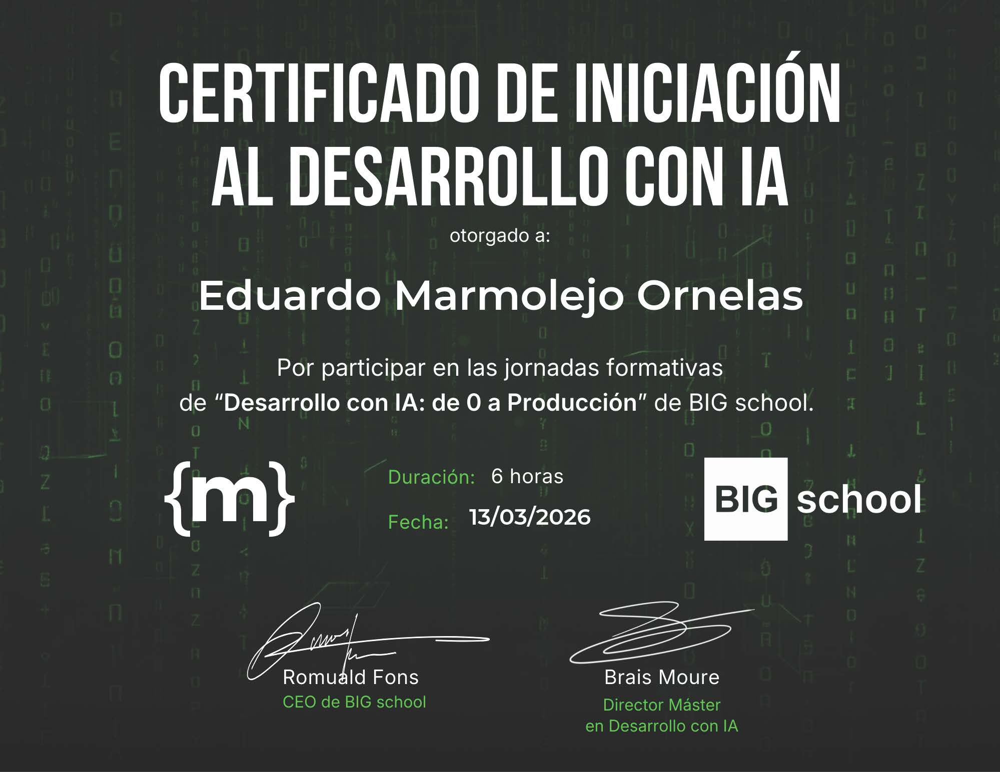
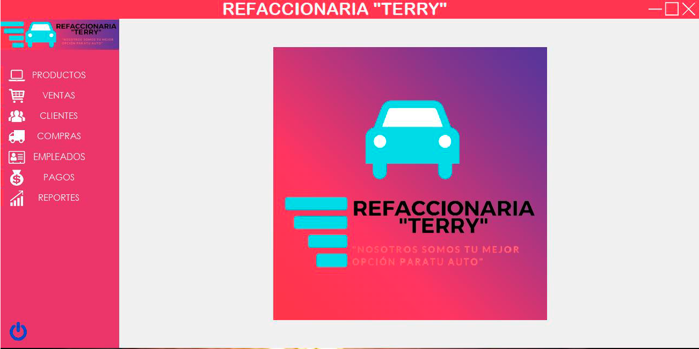
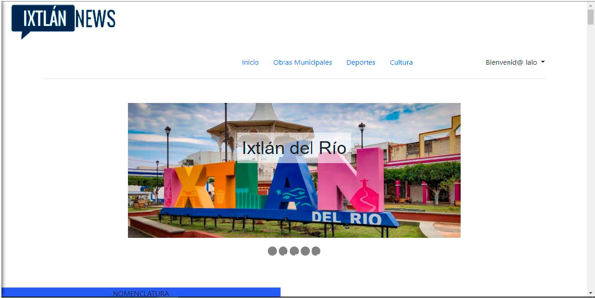
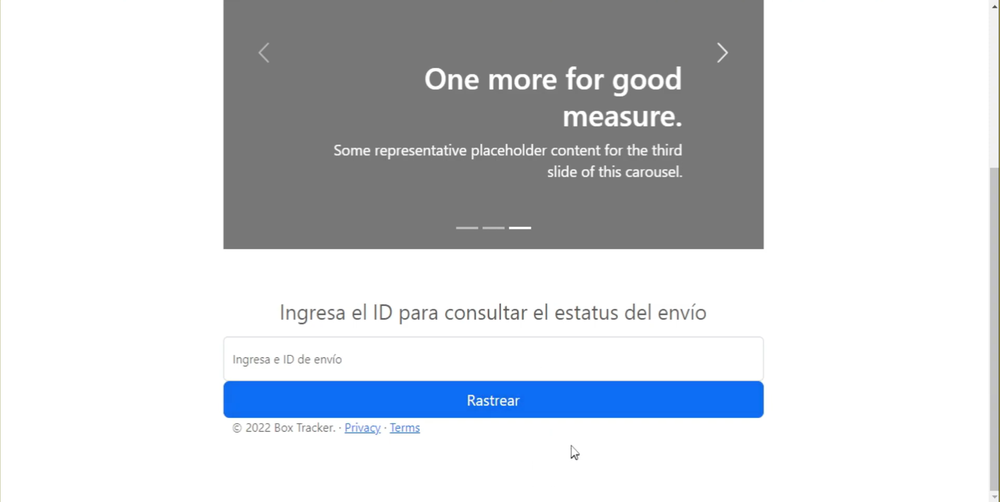
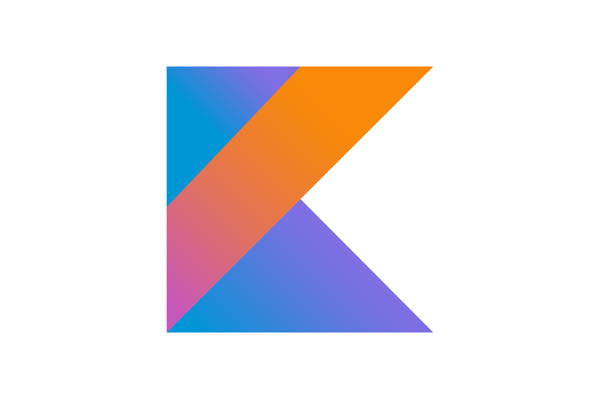
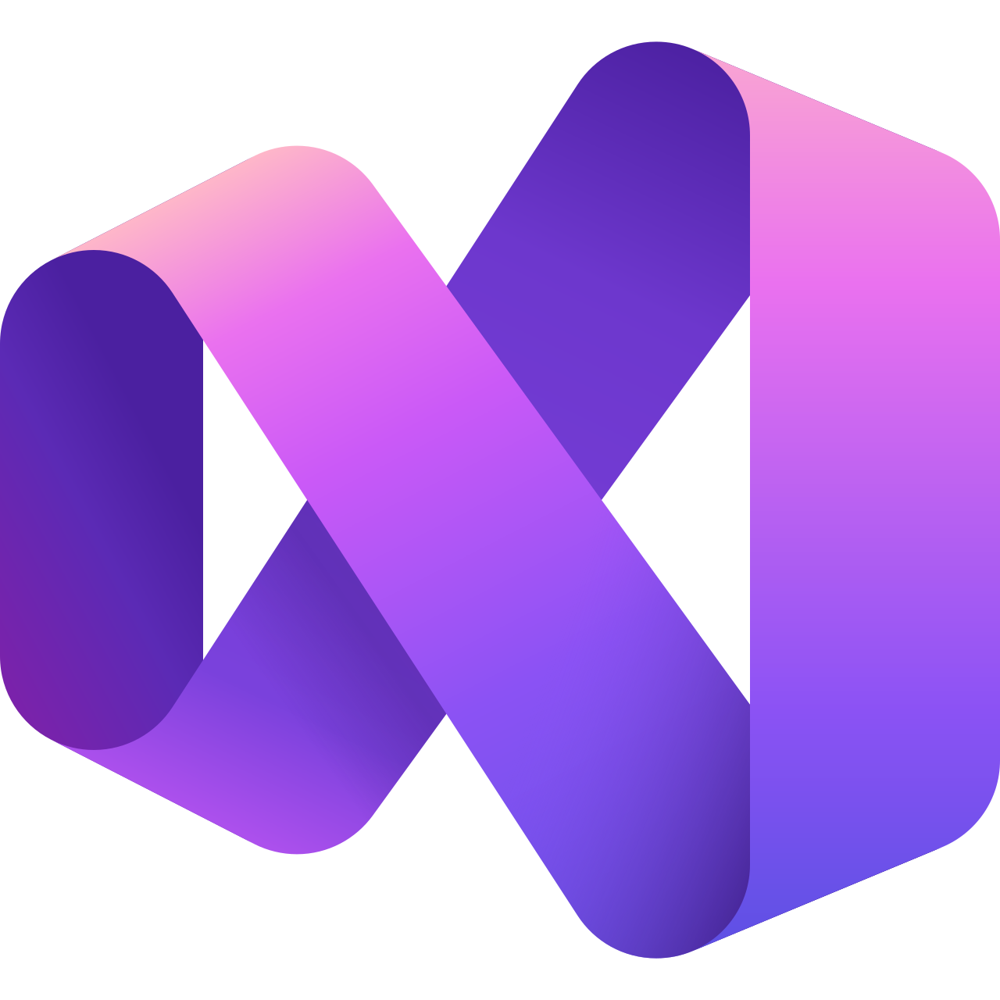
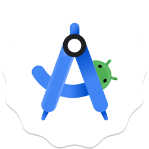

<h1 align="center">Hello &nbsp; , Soy Eduardo Marmolejo</h1>

  Ing. en Tecnologías de la Información y Comunicaciones

  <h2>🌐 Conecta Conmigo</h2>
  
¡Descubre mi trabajo y conecta en estas plataformas!

 | Eduardo Marmolejo | LinkedIn | GitHub |
| --- | --- | --- |
|  |  |  |

 

  

<h2 align="center">🚀 Sobre Mí</h2>

Ingeniero en Tecnologías de la Información especializado en desarrollo de software, automatización de procesos y aplicaciones web. Cuento con experiencia en tecnologías como C#, .NET Framework, SQL Server y desarrollo web, así como en la personalización de software especializado como Tekla Structures, lo que me permite crear soluciones eficientes orientadas a entornos empresariales y técnicos.

He complementado mi formación con certificaciones en ciberseguridad y en Desarrollo con Inteligencia Artificial de 0 a producción, fortaleciendo mis habilidades para diseñar e implementar soluciones modernas que integran IA en procesos reales, optimizando la toma de decisiones y la eficiencia operativa.

Me caracterizo por ser adaptable, proactivo y comprometido con la seguridad y el aprendizaje continuo. Disfruto resolver problemas complejos mediante la tecnología, aportar valor a los proyectos y seguir evolucionando en áreas clave como desarrollo backend, automatización e inteligencia artificial aplicada.

 

<!-- Cloud Fundamentals Certifications -->
<h2 align="center">🎓 Mis Certificaciones</h2>

  <table style="width:100%; table-layout:fixed;">
    <colgroup>
      <col style="width:16.66%">
      <col style="width:16.66%">
      <col style="width:16.66%">
      <col style="width:16.66%">
      <col style="width:16.66%">
      <col style="width:16.66%">
    </colgroup>
    <tr>
      <!-- Icon Row -->
      <td align="center">
        
      </td>
      <td align="center">
        
      </td>
    </tr>
    <tr>
      <!-- Text Row -->
      <td align="center" valign="top">
        🗓️ Abril 2025  
        🔗 <a href="https://www.coursera.org/account/accomplishments/specialization/M7VMEXU531A6">Certificado</a> 
        <!-- <em>Validates AWS Cloud concepts, billing, and infrastructure.</em> -->
      </td>
      <td align="center" valign="top">
        🗓️ Marzo 2026  
        🔗 <a href="https://www.linkedin.com/in/eduardo-marmolejo-ornelas/overlay/Certifications/1777734419/treasury/?profileId=ACoAAEEqB1kBN8HkYjPLG_cpnKMrJihlt8BN7vs">Certificado</a> 
        <!--<em>Covers Azure services, governance, and pricing models.</em>-->
      </td>
    </tr>
  </table>

 

## 📈 Certificación Próxima

Para fortalecer aún más mi certificación en Ciberseguridad, me estoy preparando activamente para las siguientes certificaciones:

| **Objetivo de la Certificación** | **Área de enfoque** |
|:---|:---|
| **Ciberseguridad y Hacking Ético** | Entender como explotan las vulnerabilidades en webs y aplicaciones, montar tu propio laboratorio de ciberseguridad en casa, reconocer los fallos de seguridad más comunes en sistemas reales y comprender como trabajan los profesionales de seguridad ofensiva y defensiva. |
<!--| **Microsoft Azure Administrator – Associate** | Resource management, security, networking, and identity services in Azure |
| **Google Associate Cloud Engineer** | GCP workload deployment, monitoring, and management |
| **HashiCorp Terraform Associate / KCNA** | Infrastructure as Code (IaC), automation, and Kubernetes cluster management |
| **Cloud Security & DevOps Specializations** | Automation, CI/CD pipelines, container orchestration, and security governance | -->

---

✅ **Objectivo:**  
**Convertirse en Desarrollador Fullstack de software**, entregando soluciones que generen valor empresarial asegurando escalabilidad, fiabilidad y seguridad..

 

<h3 align="center">Git Stats</h3>

 
  
   
   
 

<table>
  <tr>
    <td>
      
    </td>
    <td>
      
    </td>
    <td>
      
    </td>
  </tr>
</table>

### Principales Repositorios

  <table>
    <tr>
      <td>
        
      </td>
      <td>
        
      </td>
    </tr>
    <!-- <tr>
      <td>
        
      </td>
      <td>
        
      </td>
    </tr>
    <tr>
      <td>
        
      </td>
      <td>
        
      </td>
    </tr>-->
  </table>

### Gráfico de contribuciones en GitHub

 

## 🏆 Proyectos Destacados

<table>
  <tr>
    <td align="center" width="300" height="200">
      
       
      <strong>Refaccionaria "Terry"</strong>
       
      Punto de venta
    </td>
    <td align="center" width="300" height="200">
      
       
      <strong>IxtlanNews</strong>
       
      Página Web de noticias del municipio de Ixtlán del Río
    </td>
    <td align="center" width="300" height="200">
      
       
      <strong>BoxTracker</strong>
       
      Página Web para rastrear pedidos
    </td>
  </tr>
</table>

 

<h1 align="center"> Tecnologías</h1>

<h3 align="center">Web & Desktop Development</h3>

<table style="background-color: black; color: white; border: none; border-radius: 15px; overflow: hidden;">
  <thead>
    <tr>
      <th colspan="8" align="center" style="color: white;">Frontend</th>
    </tr>
  </thead>
  <tbody>
    <tr>
      <td align="center" style="border: none;">
        
         C#
      </td>
      <td align="center" style="border: none;">
        
         JavaScript
      </td>
      <td align="center" style="border: none;">
        
         HTML
      </td>
      <td align="center" style="border: none;">
        
         CSS
      </td>
      <td align="center" style="border: none;">
        
         PHP
      </td>
      <td align="center" style="border: none;">
        
         Kotlin
      </td>
    </tr>
  </tbody>
</table>

<!--  

<table style="background-color: black; color: white; border: none; border-radius: 15px; overflow: hidden;">
  <thead>
    <tr>
      <th colspan="4" align="center" style="color: white;">Backend</th>
    </tr>
  </thead>
  <tbody>
    <tr>
      <td align="center" style="border: none;">
         Node.js
      </td>
      <td align="center" style="border: none;">
         Django
      </td>
      <td align="center" style="border: none;">
         Flask
      </td>
      <td align="center" style="border: none;">
         Express
      </td>
    </tr>
  </tbody>
</table>

 -->

<table style="background-color: black; color: white; border: none; border-radius: 15px; overflow: hidden;">
  <thead>
    <tr>
      <th colspan="4" align="center" style="color: white;">Database</th>
    </tr>
  </thead>
  <tbody>
    <tr>
      <td align="center" style="border: none;">
         MySQL
      </td>
      <td align="center" style="border: none;">
         SQL Server
      </td>
    </tr>
  </tbody>
</table>

<!-- <h3 align="center">Cloud Computing & DevOps</h3>

<table style="background-color: black; color: white; border: none; border-radius: 15px; overflow: hidden;">
  <thead>
    <tr>
      <th colspan="4" align="center" style="color: white;">Containerization & Orchestration</th>
    </tr>
  </thead>
  <tbody>
    <tr>
      <td align="center" style="border: none;">
         Docker
      </td>
      <td align="center" style="border: none;">
         Kubernetes
      </td>
      <td align="center" style="border: none;">
         Helm
      </td>
      <td align="center" style="border: none;">
         Skaffold
      </td>
    </tr>
  </tbody>
</table>

  <table style="background-color: black; color: white; border: none; border-radius: 15px; overflow: hidden;">
    <thead>
      <tr>
        <th colspan="4" align="center" style="color: white;">Cloud Providers</th>
      </tr>
    </thead>
    <tbody>
      <tr>
        <td align="center" style="border: none; padding: 12px;">
           Azure
        </td>
        <td align="center" style="border: none; padding: 12px;">
           GCP
        </td>
        <td align="center" style="border: none; padding: 12px;">
           AWS
        </td>
        <td align="center" style="border: none; padding: 12px;">
           Oracle Cloud
        </td>
      </tr>
    </tbody>
  </table>

<table style="background-color: black; color: white; border: none; border-radius: 15px; overflow: hidden;">
  <thead>
    <tr>
      <th colspan="2" align="center" style="color: white;">Infrastructure as Code</th>
    </tr>
  </thead>
  <tbody>
    <tr>
      <td align="center" style="border: none;">
         Terraform
      </td>
        <td align="center" style="border: none;">
         Ansible
       </td>
    </tr>
  </tbody>
</table>

 -->

<h3 align="center">AI/ML</h3>
<!-- 

  <table style="background-color: black; color: white; border: none; border-radius: 15px; overflow: hidden;">
  <thead>
    <tr>
      <th colspan="5" align="center" style="color: white;">Languages & Libraries</th>
    </tr>
  </thead>
  <tbody>
    <tr>
      <td align="center" style="border: none;">
         Python
      </td>
      <td align="center" style="border: none;">
         NumPy
      </td>
      <td align="center" style="border: none;">
         Pandas
      </td>
      <td align="center" style="border: none;">
          
         TensorFlow
      </td>
      <td align="center" style="border: none;">
         PyTorch
      </td>
    </tr>
  </tbody>
 </table>

 -->

<table style="background-color: black; color: white; border: none; border-radius: 15px; overflow: hidden;">
  <thead>
    <tr>
      <th colspan="8" align="center" style="color: white;">FraMEWORKS & tOOLS</th>
    </tr>
  </thead>
  <tbody>
    <tr>
      <td align="center" style="border: none;">
        
         Visual Studio
      </td>
      <td align="center" style="border: none;">
        
         Visual Studio Code
      </td>
      <td align="center" style="border: none;">
        
         Android Studio
      </td>
      <td align="center" style="border: none;">
        
         Tekla Structures
      </td>
    </tr>
  </tbody>
</table>

<h3 align="center"> AI Tools & Prompt Engineering</h3>

 <table style="background-color: black; color: white; border: none; border-radius: 15px; overflow: hidden;">
  <thead>
    <tr>
      <th colspan="6" align="center" style="color: white;">AI Tools</th>
    </tr>
  </thead>
  <tbody>
    <tr>
      <td align="center" style="border: none;">
         ChatGPT
      </td>
       <td align="center" style="border: none;">
         Claude (Anthropic)
      </td>
      <td align="center" style="border: none;">
<!--          -->
         Google Gemini
      </td>
      <td align="center" style="border: none;">
         Kiro
      </td>
      <!-- <td align="center" style="border: none;">
         Meta Llama
      </td>
      <td align="center" style="border: none;">
         Cohere
      </td> -->
    </tr>
  </tbody>
</table>

<h2 align="center">📫 Conectemos</h2>

<table align="center">
  <thead>
    <tr>
      <th>Email</th>
    </tr>
  </thead>
  <tbody>
    <tr>
      <td align="center">
        <a href="mailto:eduardomarmolejojob00@gmail.com" target="_blank">
          
           
          eduardomarmolejojob00@gmail.com
        </a>
      </td>
    </tr>
  </tbody>
</table>

 

<h3>

  
⭐️ From [eduardo-marmolejo](https://github.com/eduardo-marmolejo) | Innovemos juntos!! 

</h3>

